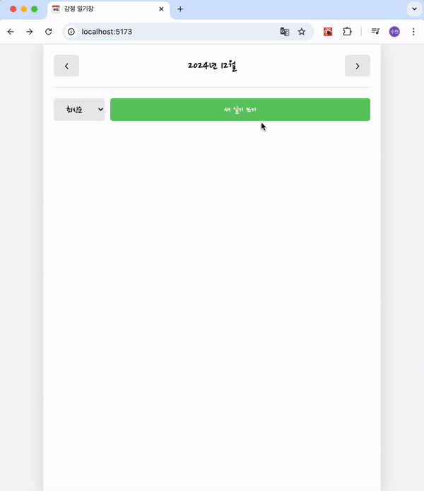
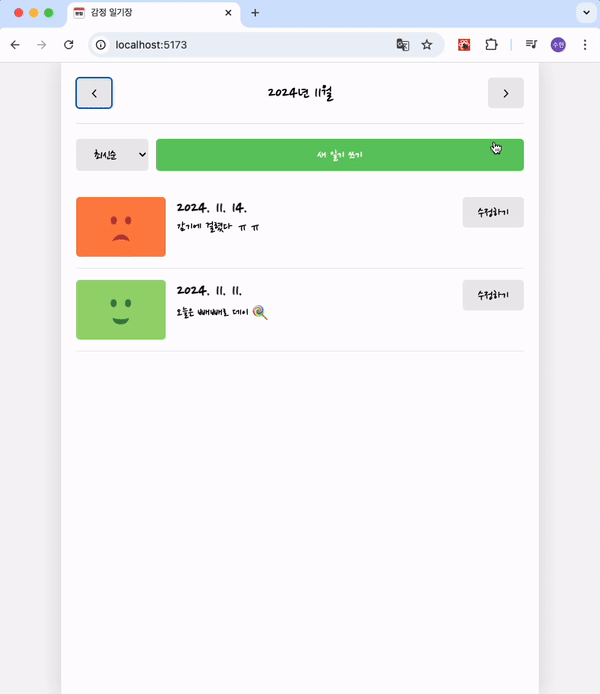

# 한입 크기로 잘라 먹는 리액트(React.js) 공부 정리

## 🌱 section06 (Simple Counter 만들기)

  
  

## 📅 section08 (Todo리스트 만들기)

  
  

## 🥳 section12 (나만의 감정 일기장 만들기)
|  | 새 다이어리 생성 과정 |
|--------------------------------------------|-----------------------|
|   | 다이어리 필터링 과정 |
