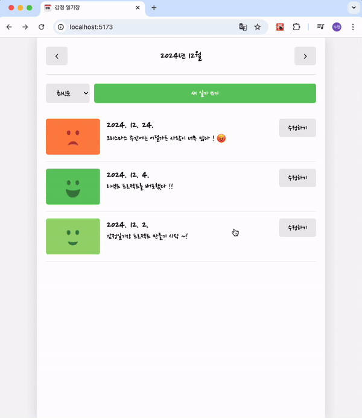
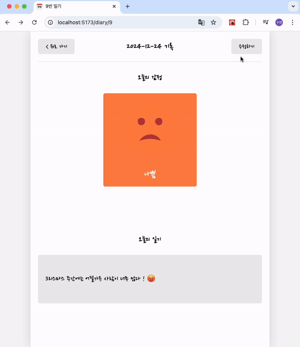

# 한입 크기로 잘라 먹는 리액트(React.js) 공부 정리

## 🌱 section06 (Simple Counter 만들기)

  
  

## 📅 section08 (Todo리스트 만들기)

  
  

## 🥳 section12 (나만의 감정 일기장 만들기)

<table>
  <tr>
    <td>일기 작성하기</td>
    <td></td>
    <td>일기 정렬 및 조회하기</td>
    <td></td>
  </tr>
  <tr></tr>
  <tr>
    <td>일기 수정하기</td>
    <td></td>
    <td>일기 삭제하기</td>
    <td></td>
  </tr>
</table>

